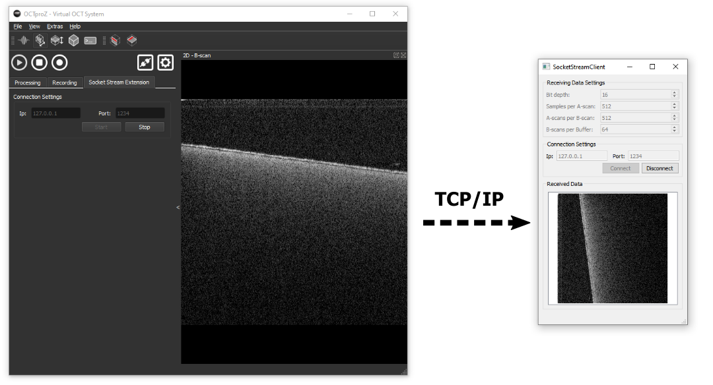

# SocketStreamClient
SocketStreamClient is a small application to test the [SocketStreamExtension](https://github.com/spectralcode/SocketStreamExtension) for OCTproZ

It receives OCT data from the OCTproZ plugin SocketStreamExtension via TCP/IP and displays the first frame of the received data. 

  

# How to install
Download SocketStreamClient from [the release section](https://github.com/spectralcode/SocketStreamClient/releases) unzip and start application. 
